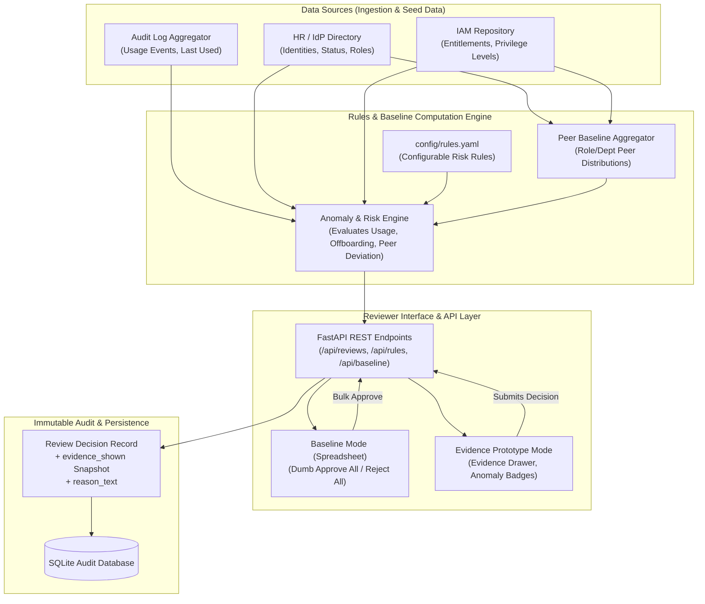

# System Architecture

## 1. High-Level Data Flow Diagram (Mermaid)



---

## 2. Text / ASCII Architecture Diagram

```
+-------------------------------------------------------------------------+
|                              DATA SOURCES                               |
|   +-------------------+   +--------------------+   +----------------+   |
|   | Identity Provider |   | Entitlement Store  |   | Usage Log Store|   |
|   +---------+---------+   +---------+----------+   +-------+--------+   |
+-------------|-----------------------|----------------------|------------+
              |                       |                      |
              v                       v                      v
+-------------------------------------------------------------------------+
|                  BASELINE & ANOMALY ANALYSIS ENGINE                     |
|                                                                         |
|  +---------------------+   +---------------------+   +---------------+  |
|  | Peer Baseline Store |   | Config (rules.yaml) |   | Rules Engine  |  |
|  +----------+----------+   +----------+----------+   +-------+-------+  |
+-------------|-------------------------|----------------------|----------+
              +-------------------------+----------------------+
                                        |
                                        v
+-------------------------------------------------------------------------+
|                          FASTAPI REST SERVICE                           |
|  - GET  /api/entitlements/review      (Fetch contextualized evidence)  |
|  - POST /api/reviews/decision         (Submit decision + rationale)    |
|  - GET  /api/rules / POST /api/rules  (Compliance Rule Admin)          |
|  - GET  /api/audit/decisions          (Audit log with evidence_shown)  |
+---------------------------------------+---------------------------------+
                                        |
                                        v
+-------------------------------------------------------------------------+
|                          FRONTEND WEB INTERFACE                         |
|  +--------------------------------+   +------------------------------+  |
|  | Baseline Review Mode (Dumb)    |   | Evidence Review Mode (Smart) |  |
|  | - Flat spreadsheet grid        |   | - Contextual risk badges     |  |
|  | - Approve-All batch action     |   | - Peer deviation drawer      |  |
|  | - Zero usage evidence shown    |   | - Mandatory override reason  |  |
|  +--------------------------------+   +------------------------------+  |
+---------------------------------------+---------------------------------+
                                        |
                                        v
+-------------------------------------------------------------------------+
|                        PERSISTENCE & AUDIT LAYER                        |
|   SQLite DB [Table: review_decisions]                                   |
|   - decision_id, entitlement_id, reviewer_id, decision                  |
|   - evidence_shown (Complete JSON snapshot of risk flags & peer stats) |
|   - reason_text (Required for anomaly overrides & revocations)          |
+-------------------------------------------------------------------------+
```

---

## 3. Component Details & Design Rationale

### A. Data Ingestion & Peer Baseline Aggregator
- **Function**: Reads identities, active entitlements, and historical usage events. Computes peer baseline metrics for every `(role_type, department, resource, privilege_level)` combination.
- **Peer Ratio Logic**: Calculates `peer_holding_pct` = `(Count of peers in same role/dept with entitlement) / (Total active peers in role/dept)`.
- **Collapse Guard**: If total active peers $N \le 2$, sets `peer_baseline_collapsed: true` to prevent false positive flags based on tiny sample sizes.

### B. Dynamic Rules Engine (`config/rules.yaml`)
- **Function**: Decouples risk scoring from code logic. Evaluates each entitlement dynamically against active rules.
- **Rule Evaluators**:
  - `OFFBOARDED_ACTIVE_ACCESS`: Triggers if identity `status == 'offboarded'` regardless of usage.
  - `UNUSED_ENTITLEMENT`: Triggers if `days_since_last_use > unused_threshold_days` (default: 90 days).
  - `PEER_DEVIATION`: Triggers if `peer_holding_pct < peer_deviation_threshold_pct` (default: 10%).
  - `HIGH_RISK_RESOURCE`: Triggers if `resource` is in `high_risk_resources` list.
  - `MISSING_JUSTIFICATION`: Triggers if entitlement `justification` is null or empty.

### C. Reviewer Interface (Baseline vs. Evidence Prototype)
- **Baseline Mode**: Renders a traditional flat table without any evidence flags or peer context. Provides a prominent "Approve All" button, recreating real-world rubber-stamping.
- **Evidence Prototype Mode**: Renders entitlement cards prioritized by risk severity score. Displays an **Evidence Drawer** showing:
  1. Days since last usage event.
  2. Peer prevalence percentage visualization.
  3. Identity employment status indicator.
  4. Original justification & granting authority.
- **Override Guard**: Enforces mandatory `reason_text` entry when a reviewer approves an entitlement with flagged anomalies or revokes access.

### D. Audit Logging with Immutable `evidence_shown` Snapshot
- **Function**: Persists decisions to SQLite.
- **Snapshot Integrity**: Storing a frozen `evidence_shown` JSON object at the moment of decision guarantees auditability. Even if usage logs or peer baselines change in the future, compliance auditors can inspect exactly what risk flags and peer stats were shown to the reviewer when the decision was executed.
